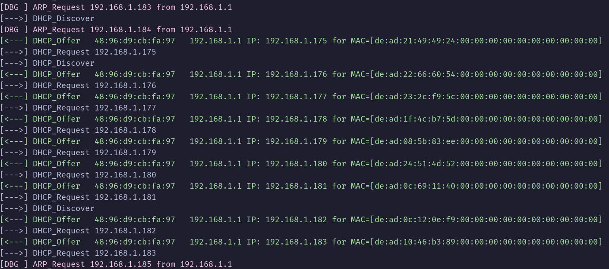
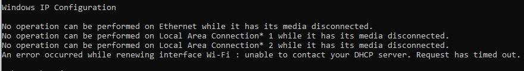

# Dokumentim i Detyrës: Realizimi dhe Analiza e një Sulmi DHCP Starvation në një Rrjet të Simuluar

## Përmbledhje

Ky punim paraqet realizimin praktik dhe analizën e një sulmi të tipit `DHCP starvation` në një rrjet të simuluar, me qëllim pengimin e përdoruesit fundor nga marrja e konfigurimit të vlefshëm në rrjet dhe si pasojë, nga aksesimi i platformës së synuar.

Sulmi u zhvillua në një rrjet LAN, ku një makinë Linux u përdor si nyje sulmuese, ndërsa një host Windows u përdor si njësi fundore/target në të njëjtin segment rrjeti.
Parimi teknik i kësaj ofensive mbështetet në konsumimin e adresave IP të lira të DHCP server-it përmes kërkesave të shumta të gjeneruara me adresa MAC të ndryshme, derisa klientët legjitimë të mos arrijnë më të marrin lease të vlefshëm.

Pas demonstrimit të bllokimit, u kryen veprimet për rikthimin e rrjetit në gjendjen normale dhe u formulua një plan konkret mbrojtës me fokus në kontrollet e shtresës së aksesit dhe të DHCP shërbimit.

## Objektivat e këtij punimi janë:

- Të demonstrohet në praktikë se si një sulm `DHCP starvation` mund të shterojë pool-in e adresave IP të një DHCP server-i dhe të bllokojë klientët legjitimë nga marrja e konfigurimit në rrjet.

- Të vëzhgohet sjellja e komunikimit DHCP gjatë sulmit, duke u mbështetur në logjikën `DORA` (Discover, Offer, Request, Acknowledge) dhe në monitorimin e paketave në rrjet.

- Të verifikohet praktikisht se hosti fundor, pas konsumimit të lease-ve të lira, nuk arrin të marrë adresë IP të vlefshme dhe humbet aksesin në rrjetin lokal dhe në shërbimet e synuara.

- Të rikthehet funksionimi normal i rrjetit pas ndalimit të ofensivës, në përputhje me kërkesën e detyrës për riaktivizimin e aksesit te përdoruesit fundor.

- Të dokumentohen masat mbrojtëse që mund të zbatohen ndaj kësaj kategorie sulmesh, si `DHCP Snooping`, port security dhe kufizimi i numrit të MAC adresave për port.

## Komponentët e mjedisit

Mjedisi i përdorur në këtë punim ishte i izoluar dhe i përshtatshëm për testim laboratorik, pa ndërveprim me rrjete publike ose sisteme jashtë skenarit testues.

Topologjia logjike përfshinte një nyje sulmuese, një nyje fundore/target dhe një pajisje ndërmjetëse që kryen rolin e router-it dhe njëkohësisht të DHCP server-it.

| Komponenti                  | Roli në skenar                    | Përshkrimi                                                                                                                                          |
| --------------------------- | --------------------------------- | --------------------------------------------------------------------------------------------------------------------------------------------------- |
| Makina Linux                | Nyja sulmuese                     | U përdor si sistem sulmues për gjenerimin e kërkesave të shumta `DHCP` duke përdorur `dhcpig`                                                       |
| Hosti Windows               | Njësia target / përdoruesi fundor | U përdor si klient legjitim që merr konfigurimin e rrjetit automatikisht nga DHCP server-i dhe që humbet aksesin pas shterimit të pool-it të IP-ve. |
| Router / DHCP Server        | Pajisja ndërmjetëse               | U përdor si nyja që ofronte lease IP për klientët e rrjetit dhe që u ndikua drejtpërdrejt nga konsumimi i lease-ve të lira.                         |
| Komandat `ipconfig`, `ip a` | Verifikim i gjendjes së rrjetit   | U përdorën për të kontrolluar adresimin IP, gjendjen e interfejseve dhe rikthimin e aksesit pas ndërprerjes së sulmit.                              |

## Metodologjia e punës

Metodologjia e ndjekur në këtë punim është e ndarë në këto faza:

1. Përgatitja e mjedisit
2. Verifikimi fillestar i lidhjes
3. Realizimi i ofensivës
4. Vëzhgimi i ndikimit në rrjet
5. Rikthimi i shërbimit
6. Propozimi i masave mbrojtëse.

Qasja laboratorike u zgjodh sepse `DHCP starvation` është një sulm i natyrës `denial of service` ndaj shërbimit të adresimit dhe duhet testuar vetëm në mjedise të kontrolluara.

### Faza 1: Përgatitja e mjedisit

Fillimisht u verifikua që hosti Windows ishte i konfiguruar për të marrë adresën IP automatikisht nga DHCP server-i, në mënyrë që reagimi ndaj mungesës së lease-ve të ishte i matshëm.

Në makinën Linux u identifikua interface-i aktiv i rrjetit me komanda të tipit `ip a`, duke siguruar që nyja sulmuese dhe target-i ndodheshin në të njëjtin segment rrjeti.

Paralelisht, u përgatit mjeti/script-i për gjenerimin e kërkesave `DHCP` të shumta, i mbështetur në `Scapy` dhe i disponueshëm si implementim praktik i njohur i `DHCPig`.

### Faza 2: Verifikimi paraprak

Para nisjes së ofensivës, u kontrollua se hosti Windows kishte adresë IP të vlefshme dhe komunikim normal me router-in ose me platformën e synuar në rrjet.

Kjo fazë ishte e rëndësishme sepse krijoi bazën krahasuese ndërmjet gjendjes normale dhe gjendjes së degraduar pas sulmit.

Në këtë pikë u ruajtën edhe screenshot-et fillestare të `ipconfig`, tabelës së adresimit dhe, sipas rastit, të aksesit funksional te platforma e synuar.

_IP që paisja kishte para sulmit (`192.168.1.3`)_


_Para sulmit paisja mund të aksesojë shërbimet e kërkuara (`ping 8.8.8.8`)_


### Faza 3: Ekzekutimi i ofensivës

Sulmi u realizua duke gjeneruar një numër të madh kërkesash DHCP Discover/Request me MAC adresa të ndryshme, me synim konsumimin e lease-ve të lira të router-it.

Në aspekt funksional, kjo e bën server-in të ndajë IP për identitete të rreme derisa klientët legjitimë të mos kenë më adresa të disponueshme.

Implementimi praktik u mbështet në skriptin `DHCPig`, i cili përdor `Scapy` për ndërtimin dhe dërgimin e paketave `DHCP` në rrjet.

Komanda e përdorura:

Për të identifikuar interface-in e makinës Linux.

```bash
ip a
```

U përdor për të kryer sulmin:

```bash
sudo ./pig.py -c -v 10 wlan0
```

_Shohim që DHCP server-i po cakton IP drejt MAC adresave të rreme_



_Shohim që e gjitha DHCP pool është mbushur_


---

---

---

### Faza 4: Verifikimi i ndikimit te target-i

Pas fillimit të sulmit, në hostin Windows u ekzekutuan komandat `ipconfig /release` dhe `ipconfig /renew` për të simuluar një kërkesë të re të klientit për një `IP`.

Në kushtet e shterimit të pool-it, klienti legjitim nuk arrin të marrë një adresë të vlefshme dhe mund të lidhet me rrjetin ose të aksesojë platformën e synuar.

Kjo fazë shërbeu si prova kryesore se përdoruesi fundor nuk mund të aksesonte më platformën e synuar për shkak të shterimit të IP-ve.

Lëshojmë adresën IP nga makina Windows:

```bash
ipconfig /release
```

_Ekzekutojmë përsëri skriptin DHCPig, dhe shohim që tashmë ky skript merr IP që e mbante makina Windows (192.168.1.3)_


Kur ekzekutojmë komandën e mëposhtme për të marrë një IP address të re makina Windows ndalon:

```bash
ipconfig /renew
```



_Konfirmojmë që paisja Windows nuk u lidh dot me rrjetin me `ipconfig`_


### Faza 5: Rikthimi i gjendjes normale

Pas intervalit të planifikuar të bllokimit, sulmi u ndërpre duke ndaluar ekzekutimin e skriptit në Linux.

Megjithatë, rikthimi i plotë i rrjetit kërkoi edhe lirimin ose pastrimin e lease-ve të rreme të ruajtura në DHCP server, pasi këto lease zakonisht mbahen për një periudhë të caktuar kohe.
​
Në këtë rast rikthimi mund të realizohet përmes fikjes dhe ndezjes së router-it/shërbimit DHCP.

### Faza 6: Masat mbrojtëse

Plani i mbrojtjes ndaj `DHCP starvation` duhet të zbatohet sa më afër pikës së hyrjes në rrjet, sepse sulmi shfrytëzon vetë mekanizmin e shpërndarjes së adresave.

#### Plan veprimi drejt mbrojtjes

- Të aktivizohet `DHCP Snooping` në switch/router, në mënyrë që porta të caktuara të konsiderohen `trusted` për serverin DHCP, ndërsa trafiku i dyshimtë nga portat e klientëve të filtrohet.
  ​
- Të kufizohet numri maksimal i `MAC adresave` të lejuara për një port fizik ose virtual, sepse `DHCP starvation` zakonisht varet nga gjenerimi i shumë identiteteve të rreme në të njëjtin segment rrjeti.

- Të monitorohen log-et e pajisjes ndërmjetëse për sjellje anormale, si numër i lartë kërkesash `DHCP` në intervale të shkurtra ose rritje e pazakontë e lease-ve aktive.

- Të segmentohen rrjetet laboratorike dhe të përdoren politika kufizuese për klientët testues, në mënyrë që ndikimi i një sulmi të mbetet i izoluar.

## Përmbledhje dhe Kufizime

Ky punim demonstron një sulm `DHCP starvation` në një rrjet të simuluar, ku përmes mjetit `dhcpig` u shterua hapësira e adresave IP për të bllokuar aksesin e përdoruesit fundor. Pas rikthimit të rrjetit, u trajtuan masat mbrojtëse si `DHCP Snooping`. Sidoqoftë, eksperimenti mbart kufizime teknike: ai reflekton kryesisht cenueshmërinë e LAN-eve të pasiguruara, pasi pajisjet shtëpiake shpesh nuk mbështesin kontrolle të avancuara të shtresës së dytë (si `Port Security`), dhe shpejtësia e sulmit varet nga hapësira e vogël e IP-ve dhe `lease time` i mjedisit lokal testues.
